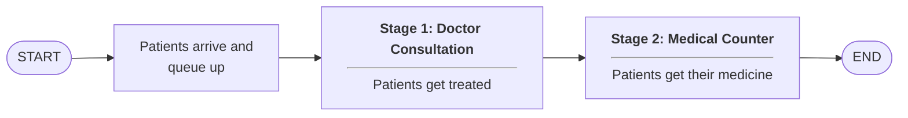
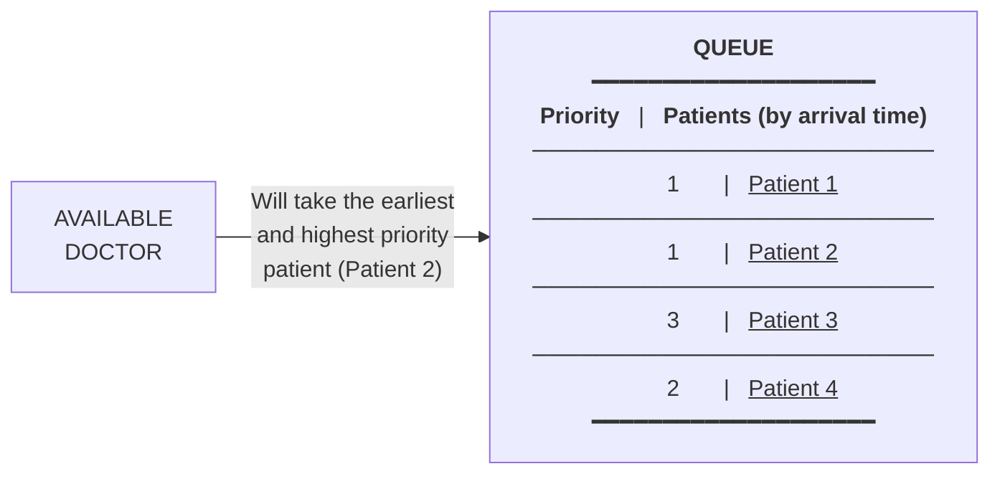
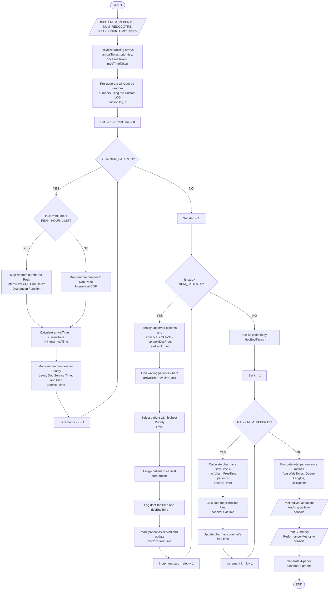
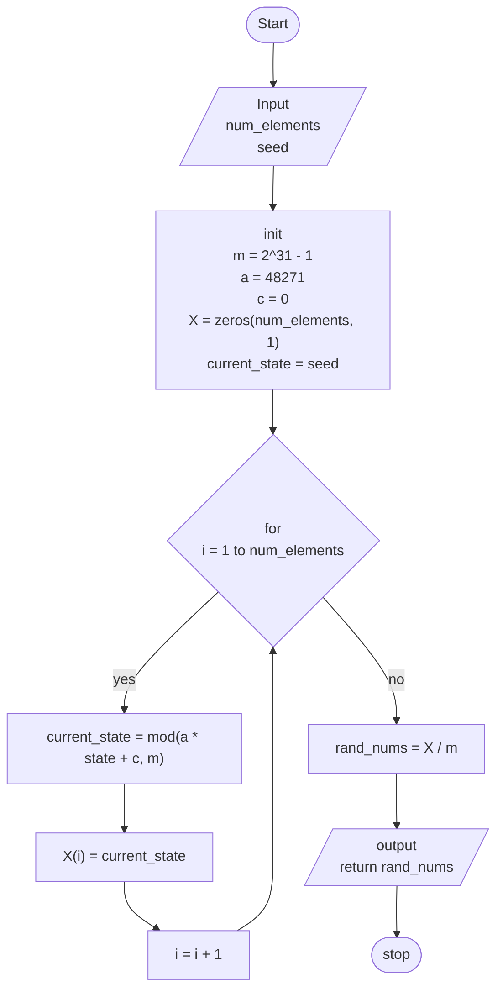
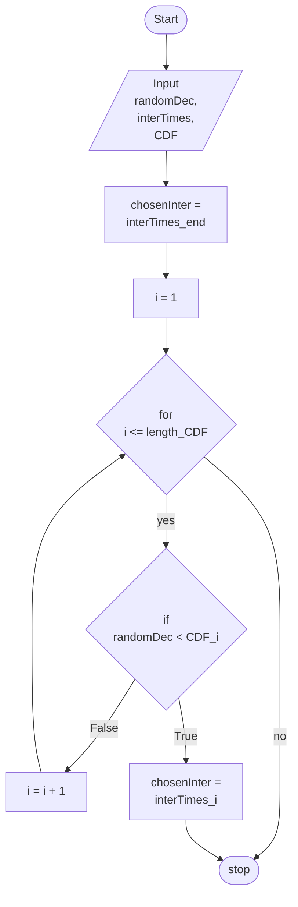

# Report On Simulation of a Hospital Emergency Department Queuing System
**TUTORIAL SECTION:** T14L-G3

## 1. PROBLEM DESCRIPTION AND OBJECTIVES
### Background & Problem Statement
In a hospital emergency department, patients arrive randomly and wait to be treated by doctors. During busy periods, long waiting times may occur. The hospital aims to evaluate and improve its service system using simulation modelling.

The Emergency Department (ED) is a crucial and critical department in a hospital. It acts as a place where life saving care for acute and critical illness or injury happens hence opens 24 hours everyday. Unlike other fields(e.g., grocery stores,banks), the queuing environment for this particular department in this field cannot be controlled. An ED can't turn away a patient easily when its capacity is breached. The arrival pattern for an ED is very volatile throughout the 24-hour cycle,cycling rapidly between quiet hours or low volume of patients and sudden surges.

This sudden surge in volume of patients can happen suddenly and its unpredictability may cause unnecessary bottlenecks which affect the welfare of patients by causing delays of critical care and simultaneously putting extra strain on the medical staff in an ED.

### Objectives
This assignment aims to:
- Apply fundamental queuing theory concepts in the development of a simulation model
- Develop and implement a functional simulation using Octave and FreeMat
- Analyse system performance using relevant performance metrics
- Propose and justify system improvements based on simulation results

## 2. ASSUMPTIONS (ARRIV AL TIMES/SERVICE PROCESSES)
This simulation implements a Queuing Simulation using random numbers to model the operational behaviors of the hospital's Emergency Department. To imitate real-life system randomness, variables are generated according to the pre-generated random digits using a Linear Congruential Generator (LCG) with a user-defined seed number to ensure repeatability. For this simulation, each patient entity requires four distinct random numbers: interarrival time, medical priority, doctor consultation time, and medicine counter service time, which are the contents of the following uniform distribution table.

### DISTRIBUTION TABLE:
#### Peak Hours
| Interarrival time (minutes) | Probability | Cumulative Distribution Function (CDF) | Random Number Range (00 - 99) |
|-----------------------------|-------------|----------------------------------------|-------------------------------|
| 3                           | 0.25        | 0.25                                   | 00 – 24                       |
| 4                           | 0.40        | 0.65                                   | 24 – 64                       |
| 5                           | 0.20        | 0.85                                   | 64 – 84                       |
| 6                           | 0.10        | 0.95                                   | 84 – 94                       |
| 7                           | 0.05        | 1.00                                   | 94 – 99                       |

During peak hours, the arrival rate increased as more people required medical attention. We skewed the distribution so that there is an 85% chance that a new patient arrives within 5 minutes of the previous one, putting stress on the queueing system

#### Non-Peak Hours
| Interarrival time (minutes) | Probability | Cumulative Distribution Function (CDF) | Random Number Range (00 - 99) |
|-----------------------------|-------------|----------------------------------------|-------------------------------|
| 3                           | 0.10        | 0.10                                   | 00 – 09                       |
| 4                           | 0.10        | 0.20                                   | 10 – 19                       |
| 5                           | 0.20        | 0.40                                   | 20 – 39                       |
| 6                           | 0.40        | 0.80                                   | 40 – 79                       |
| 7                           | 0.20        | 1.00                                   | 80 – 99                       |

During non-peak hours, patient arrivals drop significantly. The distribution is adjusted so that 60% of arrivals have an interarrival gap between 6 or 7 minutes, allowing the queue to be flushed out.

#### Service Times
#### Stage 1: Doctor Consultation
| Service time (minutes)  | Probability | Cumulative Distribution Function (CDF) | Random Number Range (00 - 99) |
|-------------------------|-------------|----------------------------------------|-------------------------------|
| 10                      | 0.30        | 0.30                                   | 00 – 29                       |
| 13                      | 0.35        | 0.65                                   | 30 – 64                       |
| 15                      | 0.20        | 0.85                                   | 65 – 84                       |
| 18                      | 0.10        | 0.95                                   | 85 – 94                       |
| 20                      | 0.05        | 1.00                                   | 95 – 99                       |

#### Stage 2: Medicine Counter
| Service time (minutes)  | Probability | Cumulative Distribution Function (CDF) | Random Number Range (00 - 99) |
|-------------------------|-------------|----------------------------------------|-------------------------------|
| 2                       | 0.35        | 0.35                                   | 00 – 34                       |
| 3                       | 0.40        | 0.75                                   | 35 – 74                       |
| 4                       | 0.15        | 0.90                                   | 75 – 89                       |
| 5                       | 0.10        | 1.00                                   | 90 – 99                       |

#### Priority Distribution
| Priority Level | Probability | Cumulative Distribution Function (CDF) | Random Number Range (00 - 99) |
|----------------|-------------|----------------------------------------|-------------------------------|
| HIGH           | 0.05        | 0.05                                   | 00 – 04                       |
| MEDIUM         | 0.30        | 0.35                                   | 05 - 34                       |
| LOW            | 0.65        | 1.00                                   | 35 - 99                       |

## 3. QUEUING MODEL DESCRIPTION



### Stage 1: Doctor Consultation
Stage 1 operates as a multi-server queue with multiple channels. The queue discipline deviates from standard First-In, First-Out (FIFO) rules where available doctors will always take the earliest and highest priority patient, but strictly following a non-preemptive scheduling where doctors will not kick their current patient out only to serve another patient with higher priority.

### Stage 2: Medicine Counter
Upon exiting Stage 1, the patient immediately enters Stage 2. Stage 2 then functions as a simple single-server, strict FIFO queue.



## 4. SIMULATION METHODOLOGY
### `main.m`


### `lcg.m` (Linear Congruential Generator)
Used to generate random numbers.



### `map_random_to_table.m`
Used to map all random numbers to the probabilities of interarrival times, service times and priority.



## 5. RESULTS (TABLES/GRAPHS)
### Configurations (user input):
> Enter number of patients: 200
> 
> Enter number of doctors: 2
> 
> Enter peak hour limit in minutes: 240
> 
> Enter random seed: 12345

### Output:
Patients data (first 10 of the 200):
```
+----------+--------+-------------+--------------+----------+----------+----------+----------+------------+------------+------------+
| Patient  | RN IAT | Interrival  | Arrival Time | Priority | Doc ID   | Doc Serv | Med Serv | Wait (Doc) | Wait (Med) | Total Time |
+----------+--------+-------------+--------------+----------+----------+----------+----------+------------+------------+------------+
| 1        | 0.28   | 4           | 4            | 1        | 1        | 15       | 5        | 0          | 0          | 20         |
| 2        | 0.41   | 4           | 8            | 1        | 2        | 13       | 3        | 0          | 3          | 19         |
| 3        | 0.58   | 4           | 12           | 1        | 2        | 13       | 2        | 19         | 2          | 36         |
| 4        | 0.63   | 4           | 16           | 2        | 1        | 10       | 2        | 3          | 0          | 15         |
| 5        | 0.05   | 3           | 19           | 2        | 2        | 10       | 4        | 2          | 0          | 16         |
| 6        | 0.73   | 5           | 24           | 1        | 1        | 10       | 2        | 18         | 0          | 30         |
| 7        | 0.44   | 4           | 28           | 2        | 1        | 13       | 4        | 1          | 0          | 18         |
| 8        | 1.00   | 7           | 35           | 1        | 2        | 18       | 4        | 9          | 0          | 31         |
| 9        | 0.90   | 6           | 41           | 1        | 2        | 13       | 4        | 21         | 0          | 38         |
| 10       | 0.45   | 4           | 45           | 3        | 1        | 10       | 4        | 7          | 4          | 25         |
```

```
--- SIMULATION SUMMARY RESULTS ---
Total Patients Served: 200
Total Simulation Time: 1345.00 mins
----------------------------------------
DOCTOR CONSULTATION:
  Average Wait Time: 176.23 mins
  Average Queue Length: 26.21 patients
  Average Doctor Utilization: 99.22%
----------------------------------------
MEDICINE COUNTER:
  Average Wait Time: 0.40 mins
  Average Queue Length: 0.06 patients
  Utilization: 44.31%
----------------------------------------
OVERALL:
  Average Total Time in Hospital: 192.95 mins
----------------------------------------
```

### Graphs:


## 6. ANALYSIS AND DISCUSSION
### Priority Queuing Behavior
The priority logic successfully protects high-acuity patients. High-priority individuals experience significantly lower average wait times compared to medium and low-priority patients.

### The Stage 1 Bottleneck
During peak hours (0 to 240 minutes), the low interarrival times heavily strain the system, causing a rapid accumulation of low-priority patients in the waiting area.

### Improvement Scenario
To optimize patient flow, we evaluated an improvement scenario by increasing the medical staff pool from 2 to 3 doctors.

### New Configurations:
> Enter number of patients: 200
> 
> **Enter number of doctors: 3 (changed from 2 to 3)**
> 
> Enter peak hour limit in minutes: 240
> 
> Enter random seed: 12345

### Output:
Patients data (first 10 of the 200):
```
+----------+--------+-------------+--------------+----------+----------+----------+----------+------------+------------+------------+
| Patient  | RN IAT | Interrival  | Arrival Time | Priority | Doc ID   | Doc Serv | Med Serv | Wait (Doc) | Wait (Med) | Total Time |
+----------+--------+-------------+--------------+----------+----------+----------+----------+------------+------------+------------+
| 1        | 0.28   | 4           | 4            | 1        | 1        | 15       | 5        | 0          | 0          | 20         |
| 2        | 0.41   | 4           | 8            | 1        | 2        | 13       | 3        | 0          | 3          | 19         |
| 3        | 0.58   | 4           | 12           | 1        | 3        | 13       | 2        | 0          | 2          | 17         |
| 4        | 0.63   | 4           | 16           | 2        | 1        | 10       | 2        | 3          | 0          | 15         |
| 5        | 0.05   | 3           | 19           | 2        | 2        | 10       | 4        | 2          | 0          | 16         |
| 6        | 0.73   | 5           | 24           | 1        | 3        | 10       | 2        | 1          | 0          | 13         |
| 7        | 0.44   | 4           | 28           | 2        | 1        | 13       | 4        | 1          | 0          | 18         |
| 8        | 1.00   | 7           | 35           | 1        | 2        | 18       | 4        | 0          | 0          | 22         |
| 9        | 0.90   | 6           | 41           | 1        | 3        | 13       | 4        | 0          | 3          | 20         |
| 10       | 0.45   | 4           | 45           | 3        | 1        | 10       | 4        | 0          | 6          | 20         |
```

```
--- SIMULATION SUMMARY RESULTS ---
Total Patients Served: 200
Total Simulation Time: 1034.00 mins
----------------------------------------
DOCTOR CONSULTATION:
  Average Wait Time: 4.96 mins
  Average Queue Length: 0.96 patients
  Average Doctor Utilization: 86.04%
----------------------------------------
MEDICINE COUNTER:
  Average Wait Time: 0.74 mins
  Average Queue Length: 0.14 patients
  Utilization: 57.64%
----------------------------------------
OVERALL:
  Average Total Time in Hospital: 22.02 mins
----------------------------------------
```

### Graphs:


This structural change redistributes work across Stage 1, significantly driving down average doctor waiting times and decreasing the average queue length in the main waiting area.

## 7. CONCLUSION AND RECOMMENDATION
### Conclusion
This hospital simulation model clearly showed the limits of the emergency care system. The current setup ensures that patients with the most serious conditions are treated first, but during busy periods, patients with less urgent conditions experience longer waiting times.

### Recommendations
Based on the simulation results, we also concluded with the following recommendations as structural adjustments:
1. **Implement Dynamic Medical Staffing:** Automatically deploy an extra doctor during peak operational windows to absorb arrival surges and keep wait times manageable.
2. **More pharmacy staff at medicine counter:** When multiple doctors discharge patients simultaneously, the medicine counter will experience a severely congested queue. Extra medicine counter staff should be deployed simultaneously to assist with prescription distribution.

## 8. REFERENCES
1. Lv, W., Liu, R., Yan, F., & Wang, Y . (2025). *Discrete Event Simulation-Based analysis and optimization of emergency patient scheduling strategies. Healthcare, 14(1), 99.* https://doi.org/10.3390/healthcare14010099
